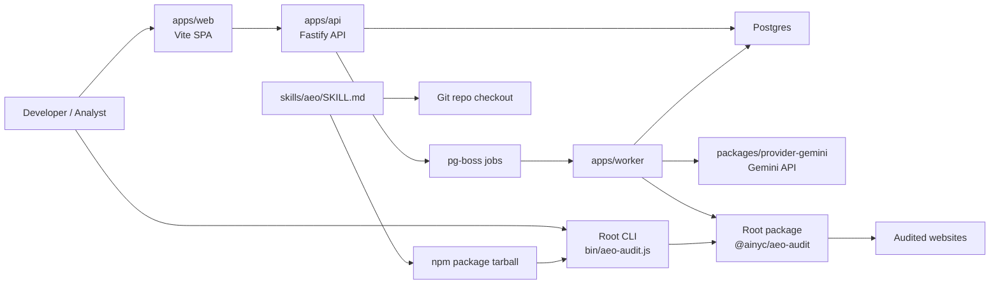

# @ainyc/aeo-audit

`@ainyc/aeo-audit` is an open-source AEO audit engine and CLI for evaluating whether a site is technically ready to be cited by answer engines such as ChatGPT, Gemini, Claude, and Perplexity. This repository now also contains the Phase 1 skeleton for a self-hosted monitoring platform built around the existing TypeScript package.

Website: [ainyc.ai](https://ainyc.ai)

## What Lives Here

- The published root package and CLI for single-site audits
- The Claude Code / ClawHub skill under `skills/aeo/SKILL.md`
- Platform scaffolding for a future self-hosted monitoring product in `apps/*` and `packages/*`
- Architecture, testing, self-hosting, and maintenance documentation in `docs/`

## Current CLI Quick Start

```bash
npx @ainyc/aeo-audit https://example.com
```

Useful variants:

```bash
npx @ainyc/aeo-audit https://example.com --format json
npx @ainyc/aeo-audit https://example.com --format markdown
npx @ainyc/aeo-audit https://example.com --factors structured-data,faq-content
npx @ainyc/aeo-audit https://example.com --include-geo
```

Exit code `0` means score `>= 70`; `1` means score `< 70`.

## Local Development

For root package and CLI development:

```bash
pnpm install
pnpm run typecheck
pnpm run build
pnpm run test
pnpm run test:e2e
pnpm run lint

# Verify the published tarball shape and shipped skill
pnpm run pack:verify
pnpm run skill:verify

# Smoke test the compiled CLI from this checkout
node bin/aeo-audit.js https://example.com --format json
```

The published package is built from `src/*.ts` into `dist/` and ships declaration files automatically.

## Self-Hosted Platform Quick Start

Phase 1 only provides a platform skeleton, not a feature-complete product. You can still boot the placeholder stack locally:

```bash
cp .env.example .env
pnpm run docker:up
```

Notes:

- You do not need a local `pnpm install` first for the Docker path.
- Compose uses container-local `node_modules` volumes so it does not try to reuse or purge your host `node_modules`.
- The first boot will spend some time installing workspace dependencies inside the containers.

Expected endpoints:

- Web placeholder: [http://localhost:4173](http://localhost:4173)
- API health: [http://localhost:3000/health](http://localhost:3000/health)
- Worker health: [http://localhost:3001/health](http://localhost:3001/health)

See [self-hosting guide](./docs/self-hosting.md) for details.

## Architecture

The long-term product keeps the existing audit package intact and adds an API, worker, Postgres, and a minimal web UI around it.



See [architecture](./docs/architecture.md) for the full design and run sequence.

## Docs Index

- [Product plan](./docs/product-plan.md)
- [Architecture](./docs/architecture.md)
- [Testing guide](./docs/testing.md)
- [Self-hosting guide](./docs/self-hosting.md)
- [Workspace packaging](./docs/workspace-packaging.md)
- [Site audit design](./docs/site-audit.md)
- [Gemini provider design](./docs/providers/gemini.md)
- [ADR 0001: Root package workspace](./docs/adr/0001-root-package-workspace.md)
- [ADR 0002: Separate score families](./docs/adr/0002-separate-score-families.md)
- [ADR 0003: Provider throttling and quotas](./docs/adr/0003-provider-throttling-and-quotas.md)

## Skill Distribution

The repository ships one umbrella skill source at `skills/aeo/SKILL.md`. There is no separate skill publish workflow in Phase 1. Skill distribution remains operational through:

- the npm tarball for `@ainyc/aeo-audit`
- direct repository checkout and copy

Examples:

- `/aeo audit https://example.com`
- `/aeo schema https://example.com`
- `/aeo monitor https://site-a.com --compare https://site-b.com`

Install locally:

```bash
git clone https://github.com/AINYC/aeo-audit.git /tmp/aeo-audit
cp -r /tmp/aeo-audit/skills/aeo ~/.claude/skills/
```

When testing unpublished changes from this checkout, build first and use the local CLI:

```bash
pnpm run build
node bin/aeo-audit.js https://example.com --format json
```

## Packaging Guarantees

The root package remains the published artifact. CI verifies that `npm pack --dry-run` contains:

- `dist/**`
- `bin/aeo-audit.js`
- `skills/aeo/SKILL.md`
- `README.md`
- `LICENSE`

CI also verifies that workspace-only code does not leak into the tarball:

- `apps/**`
- `packages/**`
- `docs/**`
- `.github/**`

## 13 Scoring Factors

| Factor | Weight | What It Checks |
|--------|--------|---------------|
| Structured Data (JSON-LD) | 12% | Presence of LocalBusiness, FAQPage, Service, HowTo schemas |
| Content Depth | 10% | Word count, heading hierarchy, paragraph structure, lists |
| AI-Readable Content | 10% | llms.txt, llms-full.txt, robots.txt, sitemap.xml availability |
| E-E-A-T Signals | 8% | Author meta, Person schema credentials, trust pages, reviews |
| FAQ Content | 8% | FAQPage schema, details/summary blocks, question-style headings |
| Citations & Authority | 8% | External links, authoritative domains, sameAs references |
| Schema Completeness | 8% | Property depth per schema type vs recommended properties |
| Entity Consistency | 7% | Name consistency across schema, title, og:title; contact alignment |
| Content Freshness | 7% | dateModified, Last-Modified header, sitemap lastmod, copyright year |
| Content Extractability | 6% | Content-to-boilerplate ratio, citation-ready blocks, paywall detection |
| Definition Blocks | 6% | "What is", "How to" headings, step lists, HowTo schema, dl elements |
| Named Entities | 6% | Brand mentions, knowsAbout/founder signals, proper noun density |
| AI Crawler Access | 4% | Per-bot robots.txt rules for GPTBot, ClaudeBot, PerplexityBot, etc. |

Optional: Geographic Signals (7%) via `--include-geo`.

## Programmatic Usage

```ts
import { runAeoAudit } from '@ainyc/aeo-audit'

const report = await runAeoAudit('https://example.com', {
  includeGeo: false,
  factors: null,
})

console.log(report.overallGrade)
console.log(report.overallScore)
console.log(report.factors)
```

## Contributing

Start with [CONTRIBUTING.md](./CONTRIBUTING.md), then use the docs linked above for testing, architecture, and packaging rules.

## License

MIT
