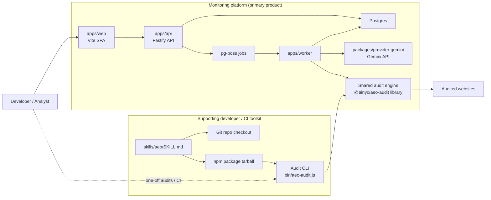
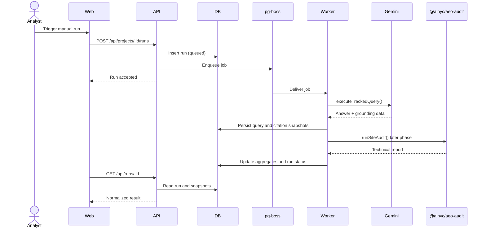

# Architecture

## Overview

The repository is structured so the current published package remains stable at the repo root while the platform grows around it. The root package continues to own fetch, analyzers, scoring, formatters, the CLI, and the skill asset. New platform services are added under `apps/*` and `packages/*`.

The monitoring app is the primary system. The audit CLI is not part of the main monitoring UX; it is supporting tooling for developers, CI, and one-off technical diagnosis.

## Component Diagram

## Why the CLI Still Exists

The monitoring app should deliver the main user experience. The CLI exists for four narrower reasons:

- one-off technical audits while debugging why a domain is or is not being cited
- CI and release checks for technical readiness outside the hosted UI
- local development and regression testing of the shared audit engine
- preserving the existing OSS package and skill distribution that already have value on their own

The primary platform path is `web -> api -> worker -> provider -> postgres`. The CLI is adjacent to that flow, not in the center of it.

## Run Flow

## Service Boundaries

- Root package: shared technical audit engine, CLI, formatters, TypeScript report types
- API: HTTP surface, validation, orchestration, read APIs
- Worker: jobs, provider execution, retries, future site audits
- Web: dashboard and bootstrap/setup UX
- Contracts: shared DTOs, enums, and validation shapes
- Config: typed environment parsing
- Provider Gemini: provider adapter and normalization layer
- DB: schema and database access layer

## Design Constraints

- The repo root must remain publishable to npm
- Skills must keep shipping through the npm tarball and repository checkout
- Platform-only code must not leak into the published tarball
- Future hosted deployment should be possible without rewriting the core data model

## Score Families

- Technical readiness: root audit engine and future site-audit rollups
- Answer visibility: provider-driven keyword tracking and citation outcomes

These remain separate to avoid mixing technical readiness with live-answer visibility.
