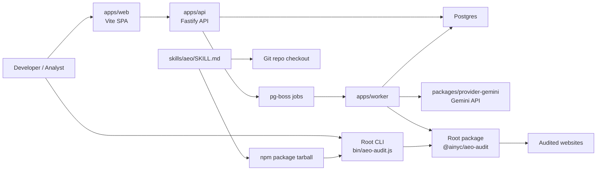
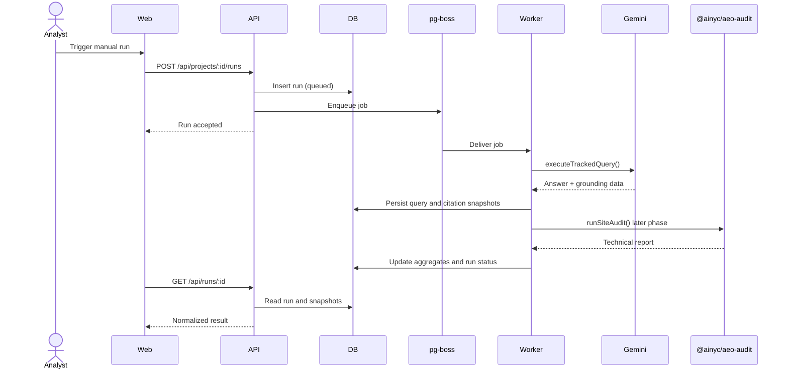

# Architecture

## Overview

The repository is structured so the current published package remains stable at the repo root while the platform grows around it. The root package continues to own fetch, analyzers, scoring, formatters, the CLI, and the skill asset. New platform services are added under `apps/*` and `packages/*`.

## Component Diagram

## Run Flow

## Service Boundaries

- Root package: technical audit engine, CLI, formatters, TypeScript report types
- API: HTTP surface, validation, orchestration, read APIs
- Worker: jobs, provider execution, retries, future site audits
- Web: dashboard and bootstrap/setup UX
- Contracts: shared DTOs, enums, and validation shapes
- Config: typed environment parsing
- Provider Gemini: provider adapter and normalization layer
- DB: schema and database access layer

## Design Constraints

- The repo root must remain publishable to npm
- Skills must keep shipping through the npm tarball and repository checkout
- Platform-only code must not leak into the published tarball
- Future hosted deployment should be possible without rewriting the core data model

## Score Families

- Technical readiness: root audit engine and future site-audit rollups
- Answer visibility: provider-driven keyword tracking and citation outcomes

These remain separate to avoid mixing technical readiness with live-answer visibility.
